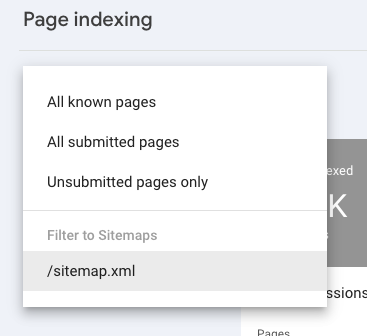
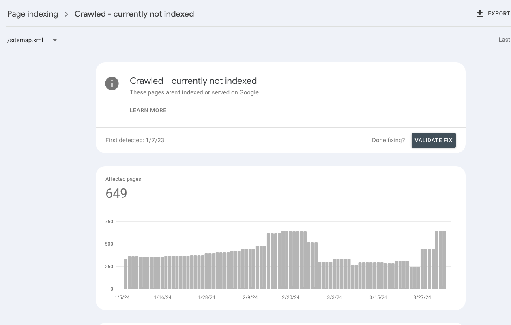

# Google page indexing api requester
This requests google to 'index' (or inform of an updated url) via [Google Indexing API](https://developers.google.com/search/apis/indexing-api/v3/quickstart)

This requires:
- The `credentials.json` file to be added to the repo (follow indexing api prereq steps)
- an updated `urls.csv` file which is retrieved from google search console.

To get the csv from search console filter urls by sitemap only

And on the category you want click export

After running, the .csv file should remove up to 200 urls based on successful requests. By default google only allows 200 urls to be indexed a day, additional requests should just fail and not remove any urls
